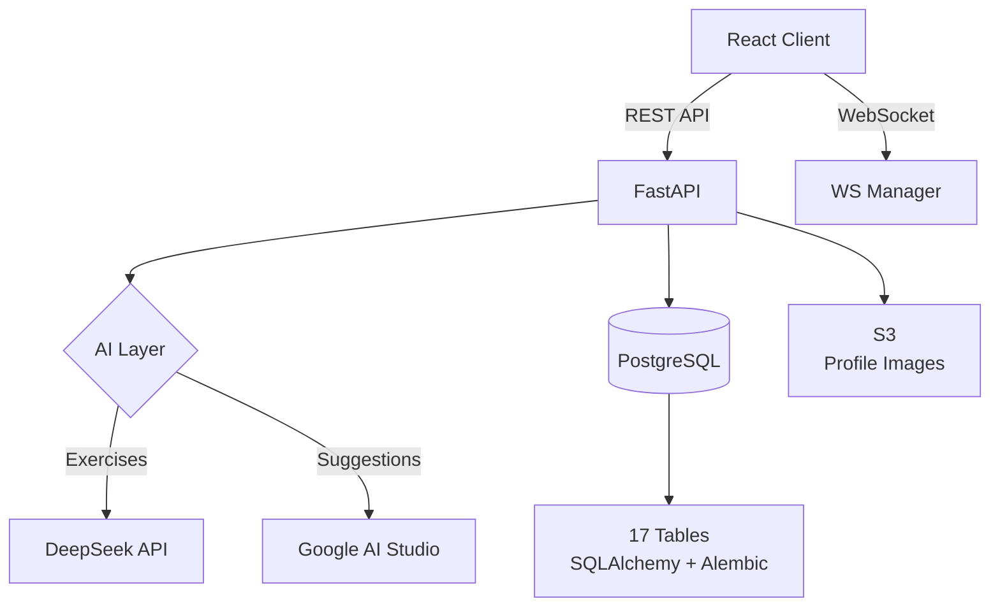

# 🏋️ TrackFitt API

> FastAPI backend for TrackFitt — AI-powered workout recommendations, real-time tracking, token gamification.


**Frontend** → [TrackFitt](https://github.com/abhiFSD/TrackFitt)

---

## Architecture



---

## What's Inside

### 57 REST Endpoints + WebSocket

**AI Features:**
- Exercise recommendations based on fitness level and goals
- Smart workout plan generation
- AI-powered exercise categorization

**Core API:**
- Full auth flow (JWT + role-based access)
- Exercise CRUD with 200+ pre-loaded exercises (CSV seed data)
- Workout creation, scheduling, and active tracking
- Workout history with detailed set/rep/weight logging
- Token economy (earn → request → distribute)
- User profiles with fitness/health/goal data
- Real-time WebSocket notifications

**Admin API:**
- User management (roles, activation)
- Exercise library management
- Token request approval/rejection

---

## Data Models (17 Tables)

| Model | Purpose |
|-------|---------|
| `User` | Auth + roles (user/admin) |
| `UserProfile` | Physical metrics, fitness level, goals |
| `Exercise` | 200+ exercises with categories |
| `ExerciseCategory` | Cardio, HIIT, Pilates, Flexibility, Strength |
| `Workout` | Custom workout templates |
| `WorkoutExercise` + `Set` | Exercises within workouts with sets |
| `ScheduledWorkout` | Planned future workouts |
| `WorkoutHistory` | Completed workout logs |
| `Token` + `TokenRequest` | Gamification currency |
| `Notification` | Real-time alerts |
| `AITracking` | AI interaction logs |

---

## Quick Start

### Docker (recommended)

```bash
git clone https://github.com/abhiFSD/TrackFitt-API.git
cd TrackFitt-API
cp .env.example .env    # Add your API keys
docker-compose up -d    # Starts API + PostgreSQL
```

API available at `http://localhost:8000`

### Manual

```bash
pip install -r requirements.txt

# Setup database
alembic upgrade head
python init-db.py

# Run
uvicorn app.main:app --reload --port 8000
```

---

## Tech Stack

| Component | Technology |
|-----------|-----------|
| Framework | FastAPI |
| Database | PostgreSQL 15 |
| ORM | SQLAlchemy 2.0 |
| Migrations | Alembic |
| AI | DeepSeek API + Google AI Studio |
| Auth | JWT (python-jose) + bcrypt (passlib) |
| Storage | AWS S3 (boto3) |
| Real-time | WebSockets |
| Deployment | Docker + Docker Compose |
| Data | CSV seed files (200+ exercises) |

---

## Project Structure

```
├── app/
│   ├── main.py                # FastAPI app + CORS + WebSocket
│   ├── api/
│   │   ├── endpoints.py       # 57 route handlers
│   │   └── auth.py            # JWT auth + password hashing
│   ├── models/models.py       # 17 SQLAlchemy models
│   ├── schemas/schemas.py     # Pydantic request/response schemas
│   ├── services/
│   │   ├── websocket_service  # Connection manager
│   │   └── notification_*     # Push notification system
│   └── db/database.py         # DB session + engine
├── dataCsv/                   # Exercise seed data
│   ├── cardio_exercises.csv
│   ├── hiit_exercises.csv
│   ├── pilates_exercises.csv
│   └── flexibility_exercises.csv
├── migrations/                # Alembic migrations
├── docker-compose.yml         # API + PostgreSQL
├── Dockerfile
└── requirements.txt
```

---

## Environment Variables

```bash
cp .env.example .env
```

| Variable | Required | Description |
|----------|----------|-------------|
| `AWS_REGION` | Yes | AWS region for S3 |
| `AWS_ACCESS_KEY_ID` | Yes | S3 access key |
| `AWS_SECRET_ACCESS_KEY` | Yes | S3 secret |
| `S3_BUCKET` | Yes | S3 bucket for uploads |
| `DEEPSEEK_API_KEY` | Yes | DeepSeek AI key |
| `GOOGLE_AI_STUDIO_KEY` | Optional | Google AI key |

---

## License

MIT
